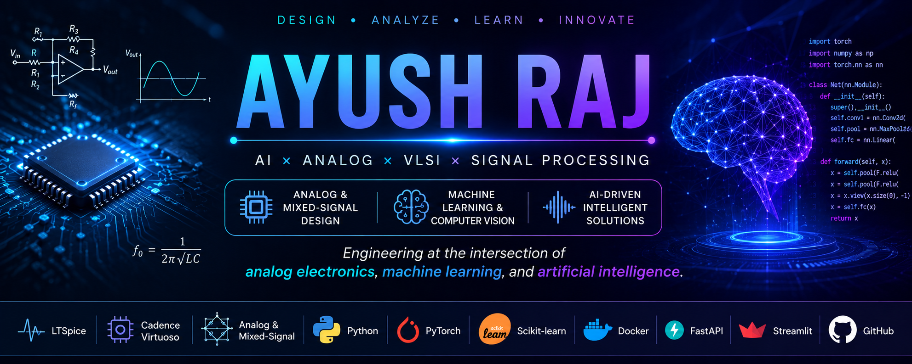

  

# 👋 Hi, I'm Ayush Raj

### Electronics System Engineering | Analog & Mixed-Signal | AI/ML

> Engineering at the intersection of **analog electronics, intelligent
> systems, and machine learning**.

🎓 B.Tech in Electronics System Engineering — NIELIT Aurangabad  
🔬 Analog & Mixed-Signal Circuit Design  
🧠 Machine Learning & Computer Vision  
⚡ VLSI • Signal Conditioning • AI Systems

)

---

| 🔬 Analog & Electronics | 🧠 AI & Machine Learning | 🚀 Systems & Deployment |
|---|---|---|
| LTSpice | PyTorch | FastAPI |
| Maxwell Bridge | Scikit-learn | Docker |
| Anderson Bridge | CNN / RNN / LSTM | Nginx |
| Op-Amp Design | CSRNet / MCNN | Streamlit |
| Signal Conditioning | NLP / XAI | CUDA |
## 🚀 Featured Projects

### 🚨 DeepVision Crowd Monitor

> **AI-powered real-time crowd density estimation and overcrowding detection**

A computer-vision system designed to estimate crowd density, visualize
density maps, and provide automated overcrowding alerts.

**🧠 AI / Computer Vision**
- CSRNet & MCNN using PyTorch
- ShanghaiTech Dataset
- Density-map generation
- OpenCV-based preprocessing

**🚀 Application & Deployment**
- Interactive Streamlit dashboard
- Heatmap visualization
- Automated Twilio / SMTP alerts
- FastAPI backend
- Docker + Nginx
- CUDA GPU acceleration
- 
🔗 **[View Project](https://github.com/Ayush73raj/deepvision-crowd-monitor)**

---

### 🔬 Signal Conditioning Circuit for Inductive Sensors

**Analog front-end design for nano-henry level inductance change detection**

- Maxwell Bridge
- Anderson Bridge
- Differential Amplifier
- Low-noise signal conditioning
- LTSpice simulation
- Hardware-oriented circuit validation

🔗 **[View Project](#)**

---

### 📰 Fake News Detection using Machine Learning

**Machine learning and NLP based fake news classification**

- 🧠 Machine Learning
- 📝 Natural Language Processing
- 🔍 Text Classification
- 🤖 Accessible AI
- 🧩 Foundation Models
- 🔬 LLM / VLM exploration

🔗 **[View Project](#)**

---

## 🛠️ Tech Stack

### 💻 Programming
`Python` `C`

### 🧠 AI / Machine Learning
`PyTorch` `Scikit-learn` `CNN` `RNN` `LSTM`  
`CSRNet` `MCNN` `NLP` `XAI`

### 🔬 Analog & Electronics
`LTSpice` `Cadence Virtuoso`  
`Maxwell Bridge` `Anderson Bridge`  
`Op-Amp` `Differential Amplifier`

### 🚀 Development & Deployment
`FastAPI` `Flask` `Streamlit`  
`Docker` `Nginx` `Twilio API`

### 🔧 Tools
`MATLAB` `GitHub` `VS Code`  
`Google Colab` `Jupyter Notebook` `CUDA`

---

## 🎓 Education

**B.Tech — Electronics System Engineering**  
National Institute of Electronics and Information Technology, Aurangabad

**2026 Graduate | CGPA: 7.96**

---

## 📫 Let's Connect

📧 **Email:** [ayush73raj@gmail.com](mailto:ayush73raj@gmail.com)

💼 **LinkedIn:** [Connect with me](https://www.linkedin.com/in/ayush-raj-34ba67267/)

🐙 **GitHub:** [Ayush73raj](https://github.com/Ayush73raj)

---

### ⚡ Building • Learning • Engineering • Innovating

⭐ If you find my projects useful, consider giving them a star!
